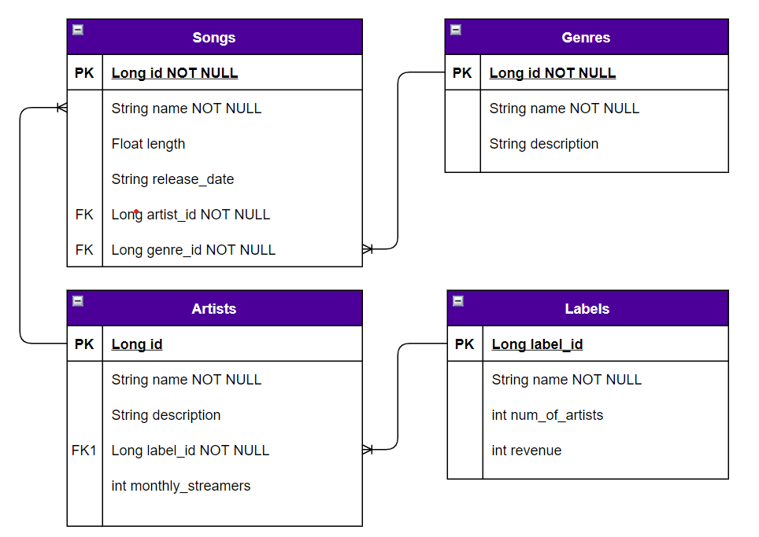

# SpotifyCreepyLittleSister
## Introduction
## General Approach
## Planning
### ER Diagram

### User Stories
#### Create
- As a user, I should be able to create a song.
- As a user, I should be able to create an artist.
- As a user, I should be able to create a genre.
- As a user, I should be able to create a label.
#### Read
- As a user, I should be able to read a song.
- As a user, I should be able to read an artist.
- As a user, I should be able to read a genre.
- As a user, I should be able to read a label.
#### Update
- As a user, I should be able to update a song.
- As a user, I should be able to update an artist.
- As a user, I should be able to update a genre.
- As a user, I should be able to update a label.
#### Delete
- As a user, I should be able to delete a song.
- As a user, I should be able to delete an artist.
- As a user, I should be able to delete a genre.
- As a user, I should be able to delete a label.
### MVP
Our minimum viable product is a working database with four models: `Songs`, `Artists`, `Genres` and `Labels`.   
## Technology Used
## Installation Instructions

