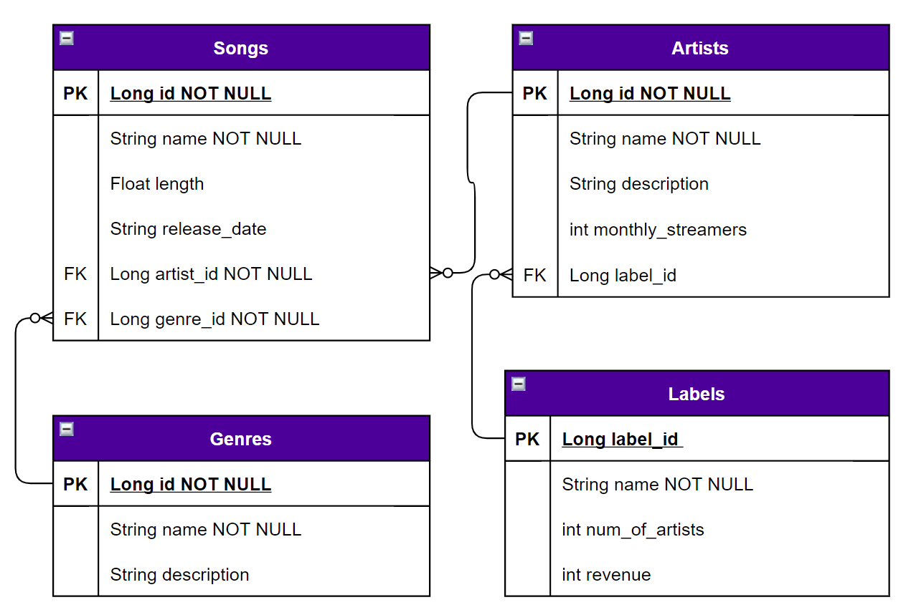

# Spotify's Creepy Little Sister

## Introduction
Spotify's Creepy Little Sister is a database which allows the user to keep track of their favorite 'Songs', 'Artists', 'Genres', and 'Labels' and how they are connected. 

## General Approach
1. Planned
2. Created Springboot Project and added Maven dependencies
3. Set up dev environment
4. Created Models
5. Figured out what endpoints we wanted to implement
6. Created Controllers, Services, and Repositories
7. Made the decision that items in the models can have the same name
8. Added JWTs allowing a user to register and log in
9. Went through and added comments where they were missing (maybe we should have done this along the way 😉)
10. Added Tests
11. Ran into issues when trying to log in user for testing other endpoints

### Endpoints
| Request Type | URL| Request Body | Request Header | Action | Access |
|--|--|--|--|--|--|
| GET | /songs | None | Authorization Bearer TOKEN |  get all the songs | Private |
| GET | /songs/{songId} | None | Authorization Bearer TOKEN | get a single song | Private |
| POST | /artists/{artistId}/genres/{genreId}/songs | song info | Authorization Bearer TOKEN | creates a single song with an artist in a genre | Private |
| PUT | /songs/{songId} | song info | Authorization Bearer TOKEN | updates a single song | Private |
| DELETE | /songs/{songId} | None | Authorization Bearer TOKEN | delete a single song | Private |
| GET | /artists | None | Authorization Bearer TOKEN | get all artists | Private |
| GET | /artists/{artistId} | None | Authorization Bearer TOKEN | get a single artist | Private |
| GET | /artists/{artistId}/songs | None | Authorization Bearer TOKEN | gets all songs by an artist | Private |
| GET | /artists/{artistId}/songs/{songId} | None | Authorization Bearer TOKEN | gets a single song by an artist | Private |
| POST | /artists | artist info | Authorization Bearer TOKEN | creates a single artist | Private |
| POST | /labels/{labelId}/artists | artist info | Authorization Bearer TOKEN | creates a single artist with a label | Private |
| PUT | /artists/{artistId} | artist info | Authorization Bearer TOKEN | updates a single artist | Private |
| DELETE | /artists/{artistId} | None | Authorization Bearer TOKEN | deletes a single artist | Private |
| GET | /labels | None | Authorization Bearer TOKEN | Get all labels | Private |
| GET | /labels/{labelId} | None | Authorization Bearer TOKEN | Gets a single label | Private |
| GET | /labels/{labelId}/artists | None | Authorization Bearer TOKEN | Gets all artists in a label | Private |
| GET | /labels/{labelId}/artists/{artistId} | None | Authorization Bearer TOKEN | Gets a single artist in a label | Private |
| POST | /labels | Label info | Authorization Bearer TOKEN | Creates a new label | Private |
| PUT | /labels/{labelId} | Label info | Authorization Bearer TOKEN | Updates a label | Private |
| DELETE | /label/{labelId} | None | Authorization Bearer TOKEN | Deletes a label | Private |
| GET | /genres | None | gets all genres | Private |
| GET | /genres/{genreId} | None | Authorization Bearer TOKEN | gets a single genre | Private |
| GET | /genres/{genreId}/songs | None | Authorization Bearer TOKEN | gets all songs in a genre | Private |
| POST | /genres | genre info | Authorization Bearer TOKEN | creates a single genre | Private |
| PUT | /genres/{genreId} | genre info | Authorization Bearer TOKEN | updates a single genre | Private |
| DELETE | /genres/{genreId} | None | Authorization Bearer TOKEN | deletes a single genre | Private |
| POST | /auth/users/register | user info | None | registers a user | Public |
| POST | /auth/users/login  | user info | None | logs a user in | Public |

## Planning

### ER Diagram

### User Stories

#### Songs Model

- As a user, I should be able to create a song.
- As a user, I should be able to read a song.
- As a user, I should be able to update a song.
- As a user, I should be able to delete a song.

#### Artists Model

- As a user, I should be able to create an artist.
- As a user, I should be able to read an artist.
- As a user, I should be able to update an artist.
- As a user, I should be able to delete an artist.

#### Genres Model

- As a user, I should be able to create a genre.
- As a user, I should be able to read a genre.
- As a user, I should be able to update a genre.
- As a user, I should be able to delete a genre.

#### Labels Model

- As a user, I should be able to create a label.
- As a user, I should be able to read a label.
- As a user, I should be able to update a label.
- As a user, I should be able to delete a label.

### MVP

Our minimum viable product is a working database with four models: `Songs`, `Artists`, `Genres` and `Labels`.
The `Songs` model will have the four CRUD endpoints created using REST conventions. When invalid requests are made, the
user will be notified by error statement.

### Timeline

| Day 1 | Day 2 | Day 3 | Day 4 | Day 5 | 
| -- | -- | -- | -- | -- | 
| Set up Spring Boot and start creating models | Finish models and start CRUD operations | Finish CRUD operations and do exception handling | Bonus material | General clean up and presentation |

## Technology Used

1. Diagram.io
2. IntelliJ (or some form of text editor)
3. Spring Boot
4. Maven
5. pgAdmin
6. postgres
7. Postman
8. JWT

## Installation Instructions
1. Fork and clone the repository.
2. Using postgres, create a database called `spotifycreepylittlesister`
3. Open the file `SpotifyCreepyLittleSister/src/main/resources/application-dev.properties` and change lines 2 to the proper port number (9092 recommended) and 7 & 9 to be your postgres username and password
4. Go into the  `SpotifyCreepyLittleSister` directory and run the application from your command line using `mvn spring-boot:run`
5. Open the url `localhost:{PORTNUMBER}/helloworld`.  If the screen says `Hello World`, you're connected and should be able to register and login a user.
